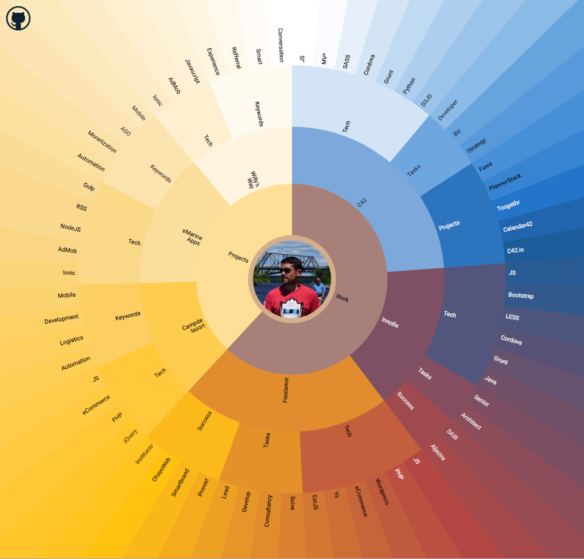

# D3JS-Sunbrust

This project is an exercise meant to learn about the awesome [D3JS](https://d3js.org) library and practice data visualization design.

Demo: http://cv.emarine.cat/

Learned from the [Coffee Flavour Wheel](https://www.jasondavies.com/coffee-wheel/) example code, I've performed some modifications to make it visually attractive, work with colors averages's, show images, etc.

## TODO's

> Of course this is a never-ending project

* Missing some data images.
* Color auto-generation
* Always, always **improve code**
